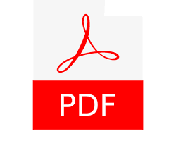

# Editor PDF Interactivo para Linux Mint

<div align="center">



**Un editor de PDF visual e interactivo con capacidades de edición directa mediante clics**

[](https://www.python.org/downloads/)
[](https://opensource.org/licenses/MIT)
[](https://www.linux.org/)

[Características](#características) • [Instalación](#instalación) • [Uso](#uso) • [Capturas](#capturas-de-pantalla) • [Contribuir](#contribuir)

</div>

---

## 📋 Descripción

Editor PDF Interactivo es una aplicación de escritorio para Linux Mint que permite editar archivos PDF de manera visual e intuitiva. A diferencia de otros editores, esta aplicación te permite **hacer clic directamente en el PDF** para colocar texto, imágenes y realizar otras operaciones de edición.

### ✨ Características Principales

#### 🖱️ Edición Interactiva

- **Click-to-place**: Haz clic en el PDF para colocar texto o imágenes exactamente donde quieras
- **Vista previa en vivo**: Overlays visuales muestran dónde se colocarán los elementos antes de guardar
- **Coordenadas en tiempo real**: Ve las coordenadas exactas mientras mueves el mouse
- **Sistema de cambios pendientes**: Revisa y aplica múltiples cambios a la vez

#### 📄 Funcionalidades de Edición

1. **Agregar Texto**
   - Click-to-place con posicionamiento preciso
   - Selector de color visual con 8 colores predefinidos
   - Selector de color personalizado
   - Control de tamaño de fuente
   - Múltiples textos en una sola operación

2. **Agregar Imágenes/Marcas de Agua**
   - Click-to-place para posicionamiento
   - Control de dimensiones (ancho y alto)
   - Soporte para PNG, JPG, JPEG, GIF, BMP
   - Vista previa del área que ocupará

3. **Eliminar Páginas**
   - Selección visual haciendo clic en las páginas
   - Overlay rojo indica páginas marcadas
   - Fácil marcar/desmarcar

4. **Reordenar Páginas**
   - Reorganiza el orden de las páginas
   - Especifica el nuevo orden deseado

5. **Unir PDFs (Mejorado)**
   - Combina múltiples archivos PDF en uno solo
   - Nueva interfaz de gestión: Agregar, Eliminar individuales, Limpiar e Invertir orden
   - Mantiene la calidad original

6. **Dividir y Extraer PDF (Mejorado)**
   - Separa un PDF en páginas individuales o extrae rangos específicos
   - Soporte para rangos inteligentes (ej: `1, 3, 5-10`)
   - Opción para extraer a archivos individuales o a un único PDF combinado

7. **Rotar PDF**
   - Rota todas las páginas (90°, 180°, 270°)
   - Opciones claras de rotación

8. **Extraer Texto**
   - Extrae todo el texto del PDF
   - Guarda en archivo .txt
   - Útil para análisis y procesamiento

#### 🎨 Interfaz de Usuario

- **Diseño de dos paneles**: Controles a la izquierda, visor interactivo a la derecha
- **Vista completa del PDF**: Todas las páginas visibles (sin límites)
- **Controles de zoom**: 50%, 75%, 100%, 150%
- **Selector de color visual**: Paleta de colores predefinidos + selector personalizado
- **Feedback visual inmediato**: Overlays, coordenadas, indicadores de estado

---

## 🚀 Instalación

### Requisitos Previos

- **Sistema Operativo**: Linux Mint (o cualquier distribución basada en Debian/Ubuntu)
- **Python**: 3.8 o superior
- **Poppler Utils**: Requerido para conversión de PDF a imágenes

### Paso 1: Clonar el Repositorio

```bash
git clone https://github.com/Rocamar/pdf_tools.git
cd pdf_tools
```

### Paso 2: Instalar Dependencias del Sistema

```bash
sudo apt-get update
sudo apt-get install -y poppler-utils python3-tk
```

### Paso 3: Crear Entorno Virtual

```bash
python3 -m venv env
source env/bin/activate
```

### Paso 4: Instalar Dependencias de Python

```bash
pip install -r requirements.txt
```

### Paso 5: Ejecutar la Aplicación

```bash
python main.py
```

O usar el script de ejecución:

```bash
chmod +x ejecutar.sh
./ejecutar.sh
```

---

## 📖 Uso

### Inicio Rápido

1. **Ejecuta la aplicación**: `python main.py`
2. **Selecciona una pestaña** según la operación que desees realizar
3. **Carga un PDF** usando el botón "Seleccionar PDF"
4. **El PDF se muestra automáticamente** en el panel derecho
5. **Realiza las ediciones** según la pestaña activa
6. **Guarda el resultado**

### Agregar Texto (Ejemplo Detallado)

1. Ve a la pestaña **"Agregar Texto"**
2. Haz clic en **"Seleccionar PDF"** y elige tu archivo
3. Escribe el texto que deseas agregar
4. Configura el **tamaño de fuente** (default: 12)
5. **Selecciona un color** de la paleta visual (o usa el selector personalizado 🎨)
6. **Haz clic en el PDF** donde quieres colocar el texto
   - Verás una cruz roja marcando la posición
   - El texto aparece en azul como vista previa
7. Puedes agregar **más textos** repitiendo el paso 6
8. Revisa la **lista de textos pendientes**
9. Haz clic en **"Aplicar y Guardar"**
10. Elige la ubicación para guardar el PDF editado

### Agregar Imagen (Ejemplo Detallado)

1. Ve a la pestaña **"Agregar Imagen"**
2. Selecciona el **PDF** y la **imagen** a agregar
3. Configura las **dimensiones** (ancho y alto en puntos)
4. **Haz clic en el PDF** donde quieres la imagen
   - Verás un rectángulo verde punteado mostrando el área
5. Agrega más imágenes si deseas
6. Haz clic en **"Aplicar y Guardar"**

### Eliminar Páginas (Ejemplo Detallado)

1. Ve a la pestaña **"Eliminar Páginas"**
2. Selecciona el PDF
3. **Haz clic en las páginas** que deseas eliminar
   - Se marcan con overlay rojo y texto "ELIMINAR"
4. Haz clic nuevamente para desmarcar
5. Haz clic en **"Eliminar Páginas Marcadas y Guardar"**

---

## 🖼️ Capturas de Pantalla

### Interfaz Principal

*Diseño de dos paneles con visor interactivo*

### Selector de Color

*Paleta visual con 8 colores predefinidos + selector personalizado*

### Edición de Texto

*Click-to-place con vista previa en vivo*

### Selección de Páginas

*Marcado visual de páginas para eliminar*

---

## 🛠️ Tecnologías Utilizadas

- **Python 3.8+**: Lenguaje de programación principal
- **CustomTkinter**: Framework de interfaz gráfica moderna
- **pypdf**: Manipulación de archivos PDF
- **pdf2image**: Conversión de PDF a imágenes
- **Pillow (PIL)**: Procesamiento de imágenes
- **reportlab**: Generación y edición de PDFs
- **poppler-utils**: Herramientas de sistema para PDFs

---

## 📁 Estructura del Proyecto

```
pdf-editor-interactive/
├── main.py                 # Aplicación principal con interfaz gráfica
├── pdf_tools.py           # Funciones de manipulación de PDF
├── requirements.txt       # Dependencias de Python
├── ejecutar.sh           # Script de ejecución
├── pdf.png               # Icono de la aplicación
├── README.md             # Este archivo
├── LICENSE               # Licencia MIT
├── .gitignore           # Archivos a ignorar en Git
└── env/                 # Entorno virtual (no incluido en Git)
```

---

## 🤝 Contribuir

¡Las contribuciones son bienvenidas! Si deseas mejorar este proyecto:

1. **Fork** el repositorio
2. Crea una **rama** para tu característica (`git checkout -b feature/AmazingFeature`)
3. **Commit** tus cambios (`git commit -m 'Add some AmazingFeature'`)
4. **Push** a la rama (`git push origin feature/AmazingFeature`)
5. Abre un **Pull Request**

### Ideas para Contribuir

- 🎨 Más colores predefinidos en la paleta
- 🔄 Drag-and-drop para reordenar páginas
- 📝 Formas geométricas (rectángulos, círculos, flechas)
- 🔍 Búsqueda de texto en PDFs
- 🌐 Soporte para más idiomas
- 📱 Versión para otras plataformas (Windows, macOS)
- ⚡ Optimizaciones de rendimiento
- 🧪 Tests automatizados

---

## 🐛 Reportar Problemas

Si encuentras un bug o tienes una sugerencia:

1. Verifica que no exista ya un [issue](https://github.com/Rocamar/pdf_tools/issues) similar
2. Crea un nuevo issue con:
   - Descripción clara del problema
   - Pasos para reproducirlo
   - Comportamiento esperado vs actual
   - Capturas de pantalla si es relevante
   - Información del sistema (OS, versión de Python, etc.)

---

## 📝 Licencia

Este proyecto está bajo la Licencia MIT. Ver el archivo [LICENSE](LICENSE) para más detalles.

---

## 👨‍💻 Autor

**Rodolfo**

- GitHub: [@Rocamar](https://github.com/Rocamar)

---

## 🙏 Agradecimientos

- A la comunidad de Python por las excelentes bibliotecas
- A los desarrolladores de CustomTkinter por el framework de UI
- A todos los que contribuyan a este proyecto

---

## 📚 Documentación Adicional

### Coordenadas del PDF

El sistema de coordenadas de PDF usa:

- **Origen**: Esquina inferior izquierda (0, 0)
- **Unidades**: Puntos (1 punto ≈ 1/72 pulgadas)
- **Página carta estándar**: 612 x 792 puntos

La aplicación convierte automáticamente las coordenadas de clic a coordenadas PDF.

### Rendimiento

Para PDFs grandes (50+ páginas):

- Usa zoom 50% para vista general
- La carga puede tomar unos segundos
- Considera aplicar cambios en lotes

### Limitaciones Conocidas

- Requiere `poppler-utils` instalado en el sistema
- PDFs con más de 100 páginas pueden consumir más memoria
- No soporta edición de PDFs encriptados

---

## 🔄 Changelog

### v1.1.0 (2026-01-14)

**Nuevas características y mejoras de UI:**

- ✅ **Extracción específica**: Extrae páginas por número o rango (ej: 1,3,5-8)
- ✅ **Gestión avanzada de unión**: Botones para agregar/eliminar archivos individuales en la lista de unión.
- ✅ **Estandarización de interfaz**: Iconos consistentes y mejor agrupamiento de botones en todas las herramientas.
- ✅ **Panel de control mejorado**: Diseño más limpio y botones con feedback visual.

### v1.0.0 (2026-01-13)

---

<div align="center">

**⭐ Si este proyecto te resulta útil, considera darle una estrella en GitHub ⭐**

Made with ❤️ for the Linux Mint community

</div>
